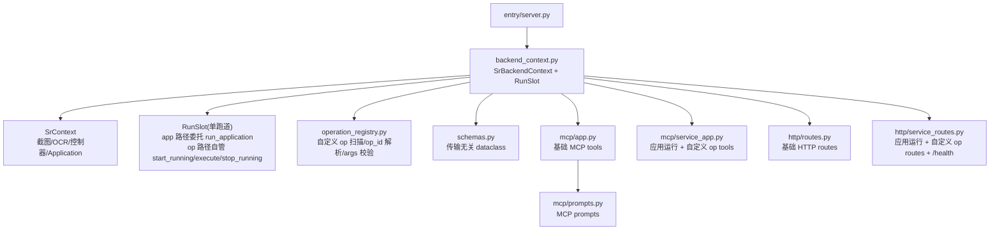

# 后端服务层架构

> `SrBackendContext` 是 `SrContext` 之上的传输无关 backend。它不关心调用方来自 MCP、HTTP 还是 GUI 管理页，只提供稳定的业务方法和运行状态。

## 概览



## 模块布局

```text
src/sr_od/backend/
  schemas.py             # WindowStatus / AnalyzeScreenResult(含 extras) / RunStatusResult / ApplicationListResult / OperationListResult
  backend_context.py     # SrBackendContext + RunSlot（单槽，app/op 分派）+ analyze 接入额外识别器
  operation_registry.py  # 自定义 op 扫描 / op_id 解析 / args 校验（纯反射，不实例化）
  screen_recognizer_scan.py  # 画面额外识别器(recognizer)扫描 + 注册表填充（镜像 operation_registry,扫描期无参实例化）
  mcp/
    app.py               # create_mcp_server + 基础 game tools
    service_app.py       # list_applications / run_one_dragon / run_standalone_app / list_operations / describe_operation / run_operation
    prompts.py           # MCP prompt 案例与注册
  http/
    routes.py            # register_http_routes + 基础 /game/* handler
    service_routes.py    # /health + 应用运行 + 自定义 op HTTP handler
  entry/
    server.py            # create_app / uvicorn 入口

# 公共包（游戏无关,ZZZ 可复用）
src/one_dragon/base/screen/
  screen_recognizer.py   # ScreenRecognizer 基类 + ScreenRecognizerRegistry + RecognizerScanResult
```

> 画面额外识别器（per-screen recognizer）的**契约**（基类 / 注册表 / 扫描结果）在公共包 `one_dragon/base/screen/screen_recognizer.py`（与 `screen_match.py` 同域,游戏无关）;**扫描器**（扫 `sr_od` 承载包、填注册表）在 `sr_od/backend/screen_recognizer_scan.py`（须知游戏扫描根,公共包不能反向依赖游戏代码）。详见 [screen-recognizers.md](screen-recognizers.md)。

## SrBackendContext

`SrBackendContext` 持有一个 `SrContext`，由服务入口注入。所有对外方法在进入业务逻辑前先检查 `ctx.ready_for_application`。

| 方法 | 作用 | 返回 |
|---|---|---|
| `check_window()` | 查询游戏窗口状态 | `WindowStatus` |
| `capture()` | 截取当前游戏画面 | RGB `MatLike` |
| `analyze()` | 截图 + OCR + 画面匹配 + 精准命中跑额外识别器 | `AnalyzeScreenResult`（含 `extras`） |
| `start_run(source, op_factory, display_name=None)` | 启动 operation（op 路径，供 `open_game` / `run_operation` 经适配器调用） | `(ok, future)` |
| `run_one_dragon(source)` | 按当前配置启动完整一条龙（app 路径） | `(ok, future)` |
| `run_standalone_app(source, app_id=None)` | 启动独立应用（app 路径） | `(ok, future)` |
| `list_applications()` | 列出当前实例可运行应用和独立应用选择状态（只读，不刷新配置） | `ApplicationListResult` |
| `query_status()` | 查询当前或最近一次运行状态（单槽，直接委托） | `RunStatusResult` |
| `stop()` | 发出停止信号（单槽） | `dict` |
| `close_game()` | 发关闭窗口信号，不走运行槽 | `str` |

> 自定义 operation 运行入口（`list_operations` / `describe_operation` / `run_operation`）不经过 `SrBackendContext` 方法，而是由 MCP / HTTP 适配器直接调用 `operation_registry`（扫描 / 解析 / 校验）+ `run_slot._start`（op 路径），详见 [mcp.md](mcp.md) / [http.md](http.md)。

## 运行槽

`SrBackendContext` 只持有**一个** `RunSlot`，所有运行（一条龙 / 独立应用 / `open_game` / 自定义 op）都经 `run_slot._start` 进入同一条单跑道。槽只做两件事：**单跑道调度** + **终态固化**；执行序列在槽内按 app / op 分派。

| 路径 | 触发入口 | 执行序列 | 进度句柄 | 结果来源 |
|---|---|---|---|---|
| **app** | `run_one_dragon` / `run_standalone_app` | 委托 `run_application`（复用 GUI/CLI 共享入口，内含 `start_running` / 绑定 / `execute` / `stop_running`） | `run_context.current_application` | `run_context.last_application_result` |
| **op** | `open_game` / `run_operation`（自定义 op） | 槽自己 `start_running → op_factory(ctx) → op.execute() → finish_running()`（自然完成走 `finish_running` 收口，不置停机中断闩，见 ADR-0396） | 槽内 `current_op` | `op.execute()` 返回值 |

- **单跑道互斥**收进 `_start` 锁内：`future` 未完成检查与 `executor.submit` 在同一把锁中原子完成（check-then-submit），消除跨槽 check-then-act 竞态；框架层 `run_context.start_running` 不可重入是第二重保证。
- **字段**（单一事实源）：`source`、`op_id`（app 路径=app_id、op 路径=`package.path.ClassName` 或类名）、`run_type`（`APPLICATION` / `OPERATION`）、`app`（展示名，`_run` 内固化）、`started_at` / `finished_at`、`terminal_state`、`last_status`、`failed_node`、`current_op`（op 路径回填，app 路径为 `None`）。
- **终态固化**：`_run` 用顶层 try/except/finally 包裹，任何路径（含 `refresh_config` / `run_application` 抛异常）都固化 `terminal_state`，避免卡 `RUNNING`。
- **进度读取**统一：`_query_status` 在运行态读 `progress = current_op or run_context.current_application`（Application 也是 Operation，都有 `_current_node` / `node_retry_times`）；终态读固化的 `terminal_state`。
- **配置刷新**：app 路径把 `_refresh_runtime_config` 作为 `refresh_config` 钩子注入 `_run`（槽线程内、`_start` 已赢锁后、`run_application` 前执行）——拒绝路径不进 `_run`，因此不刷新，修原跨方法刷新竞态；`current_instance_idx` 在刷新后重读（可能切实例）。`list_applications` 是只读路径，**不**刷新配置。
- **stop**：`_stop` 对未完成运行调 `run_context.stop_running()` 发信号；停机中断闩置位后，controller 层停机守卫（ADR-0396）在**任何游戏输入动作前**抛 `StopRunInterrupted` 穿透执行链——信号到实际退出间不再有游戏输入落地（收口/遥测等只读收尾仍有短暂过渡期，期间 `_query_status` 仍报 `running`，`RunState` 无 `STOPPING` 态，沿用现状）。手动输入端点（`click_game` 等）先消费闩（显式外部接管放行）。

`SrBackendContext.query_status()` 和 `SrBackendContext.stop()` 各自塌缩为一次 `run_slot._query_status()` / `_stop()`，不再跨槽仲裁。

## 自定义 operation 运行入口

`operation_registry.py` 提供「按 operation 运行」的通用能力（不框死为调试；当前主用于开发者复现 bug 时逐个 op 精确定位，未来智能体可经此自由组合 op）：

- `scan_operations(ctx, refresh=False)`：扫描 `sr_od.operations` 承载包（SR 仅此一个 operation 承载包），三重过滤（`__module__` 守卫 + 显式抽象基类集 + `*Base` 兜底 + 排除 `Application` 子类），纯反射 `__init__` 参数（**不实例化**），结果缓存。
- `resolve_op_class(op_id)`：按 `<dotted module path>.<ClassName>` 解析出 Operation 子类（`importlib` + `__module__` 守卫 + `issubclass(cls, Operation)`）。
- `validate_args(cls, args)`：校验必填参数齐全 + 参数类型可传入(JSON 标量/列表/字典,或 `@dataclass`+`from_dict` 可从 dict 反序列化);其余复杂数据类拒绝(提示走 application)+ 值可 JSON 序列化。
- `coerce_dataclass_params(cls, args)`：实例化前把 `@dataclass`+`from_dict` 参数的 dict 值用 `from_dict` 反序列化为实例;`run_operation` 构造 op 前调用,使这类参数可经 JSON dict 传入(SR 当前业务 op 暂无此类参数,能力前置就绪)。
- `describe_operation(ctx, op_id)`：纯反射返回单个 op 的参数 schema(每个参数标 `json_serializable` + `coercible`——后者表示 `@dataclass`+`from_dict` 可从 dict 反序列化;整体 `debuggable` = 必填参数都可传入)。

`run_operation` 在适配器侧组合上述能力：`resolve_op_class` + `validate_args` 先校验，通过后把 `cls` + `args` 烤进闭包 `op_factory = lambda ctx: cls(ctx, **args)`，提交 `run_slot._start`（op 路径，`display_name=op_id`）。槽只认统一签名 `op_factory(ctx) → Operation`，对 `open_game` 与自定义 op 一视同仁。

## 画面额外识别器（per-screen recognizer）

`analyze()` 在画面**精准命中**后,按 `screen_name` 查注册表调用该画面声明的**额外识别器（recognizer）**,做该画面特有的额外识别（如货币战争备战画面的金币 / 阶段 / 阵营在场人数）,把结构化领域事实塞进 `AnalyzeScreenResult.extras` 回传。这是 per-screen **注册机制 + 自动加载**:[design-principles.md](design-principles.md) **P2**（server 给领域事实）。

- **契约在公共包**:`one_dragon/base/screen/screen_recognizer.py` 的 `ScreenRecognizer`（类属性 `screen_name` + `recognize(ctx, image, screen_info) -> dict | None`）+ `ScreenRecognizerRegistry` + `RecognizerScanResult`。游戏无关,ZZZ 可复用。
- **扫描器在 SR backend**:`screen_recognizer_scan.scan_recognizers(ctx, refresh=False)` 镜像 `operation_registry.scan_operations`（`_SCAN_ROOTS` + rglob + `__module__` 守卫 + 模块级 `_CACHE`）,扫描 `sr_od.operations` + `sr_od.application`,挑 `ScreenRecognizer` 子类 → **无参实例化** → 按 `.screen_name` 注册（唯一差异:op 扫描纯反射不实例化,recognizer 扫描会 `attr()` 实例化,故 recognizer `__init__` 必须无副作用零参数）。惰性,首次精准命中触发整树扫描,之后 `dict.get`。
- **接入**:`backend_context.analyze()` 精准命中后 `get_recognizer(ctx, screen_name)` → `recognizer.recognize(...)`;整个查表+调用包在 try 里,**任一步异常 → `extras=None`,绝不中断 analyze**（错误隔离）,`json.dumps(extras)` 校验防非序列化值漏到序列化层。
- **并发安全(关键)**:`analyze_screen` 不查 `run_slot`,可与运行中 operation 并发 → recognizer 必须是**纯读**:不写 `self.`、不写模块全局、不读写 `cw_match.session`。故货币战争备战 recognizer 用纯 reader + 自写 `_read_phase_round_pure`（不复用写全局的 `read_phase_round`）。
- 新增画面识别器（怎么写 / 放哪 / 契约）见 [screen-recognizers.md](screen-recognizers.md)。

## 适配器

MCP 与 HTTP 只做传输适配：

- MCP 基础工具在 `mcp/app.py`，应用运行 + 自定义 op 工具在 `mcp/service_app.py`，prompt 在 `mcp/prompts.py`。
- HTTP 基础端点在 `http/routes.py`，应用运行 + 自定义 op 和 `/health` 在 `http/service_routes.py`。
- 应用运行类 tool / 端点只调 `SrBackendContext` 公开方法；自定义 op 类 tool / 端点额外经 `operation_registry` 校验后调 `run_slot._start`（op 路径）。

## 进程模型

- `entry/server.py` 是 headless server 入口，会创建独立 `SrContext`。
- GUI 主程序仍是另一个入口；「开发工具 -> MCP 服务」页面启动的是本机 server 子进程。
- 当前只保证同一 backend 进程内的运行互斥；GUI 主进程与外置 server 子进程之间不做跨进程互斥。

## 路线图（尚未实现）

- 事件推送：WebSocket / SSE 或 MCP notifications。
- 多实例：`list_instances` / `switch_instance`。
- 更多 game 感知与交互 tool。
- 更完整的 AI 操作范式。

## 相关文档

- [README.md](README.md) - 总览
- [mcp.md](mcp.md) - MCP 适配器
- [http.md](http.md) - HTTP 适配器
- [entry.md](entry.md) - 服务入口
